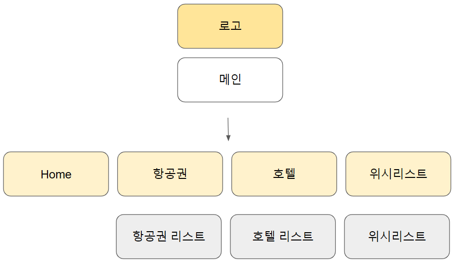
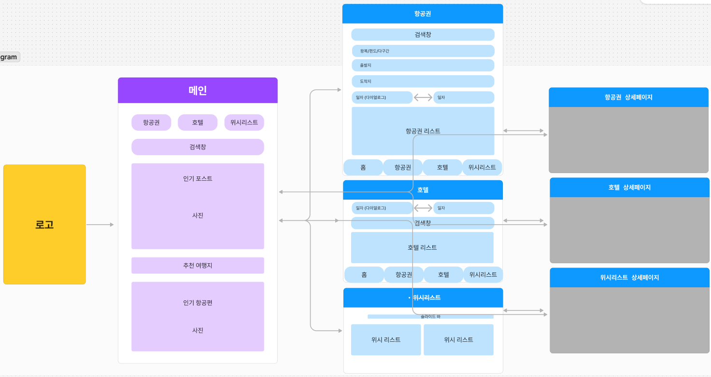
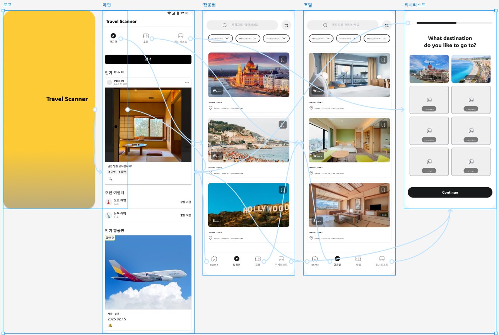

# Trevel Scanner(여행 앱) 분석 및 역설계 하기

## 앱 정보

- **앱 이름** 

  - Trevel Scanner    

- **시장(마켓)**  

  - 2023년 기준 글로벌 여행 앱 시장 규모는 약 1000억 달러 이상, 특히 호텔 예약, 항공권 검색, 여행 계획을 돕는 앱들의 수요가 급증하고 있

- **타겟**  

  - "올-인-원"으로 여행 준비를 간편하게 하길 원하는 고객층        

## 앱 구조도

## 앱 와이어프레임 (사용 툴 : FigJam)

## 프로토타이핑 (사용 툴 : Figma)

## 페이지 구현 (Figma)
1. 로고 - 첫 화면입니다. Trevel Scanner 로고를 클릭하면 메인 화면으로 이동합니다.
2. 메인 - 메인 화면입니다. 검색창, 인기 포스트, 추천 여행지, 인기 항공편 페이지로 구성되어 있습니다.
3. 항공권 - 항공권 목록
4. 호텔 - 호텔 목록
5. 위시리스트 - 항공권과 호텔 리스트 중 찜한 목록

## 구현영상 (Figma)

## 참고 학습 자료 
- 피그마 AI로 3초만에 와이어프레임 그리기 https://www.youtube.com/watch?v=Jm9h_JmEnu8&t=504s
- 피그마 와이어 프레임(wire frame) 템플릿 https://lionbum.tistory.com/220
- 피그마 상단 네비게이션 메뉴바 고정 https://www.youtube.com/watch?v=kUGUtOaSyw8
- 피그마 프로토타이핑 마스터하기 https://www.youtube.com/watch?v=D01uU68qRv0&t=389s

## 회고
시간이 부족하여 앱 구조도, 와이어프레임, 프로토타이핑까지만 완료하였고, 실제로 플러터를 구현해보지 못해 아쉽습니다.
하지만, 이번 학습을 통해 어플리케이션 개발의 체계적인 과정을 배우고 이해할 수 있어 매우 유익했습니다.
이번 경험을 바탕으로, 평소에 만들어보고 싶었던 어플을 실제로 구현해볼 계획입니다.
