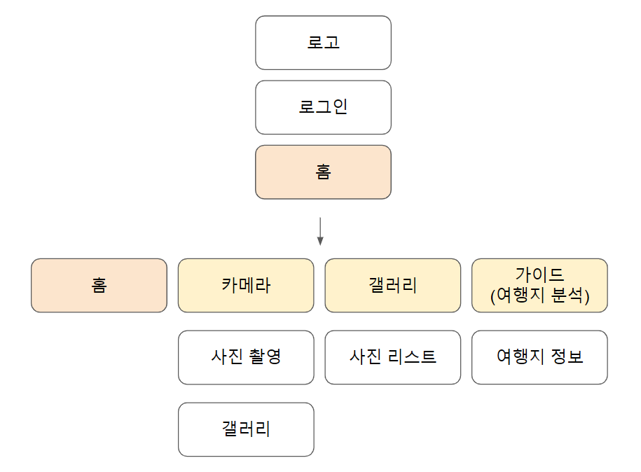
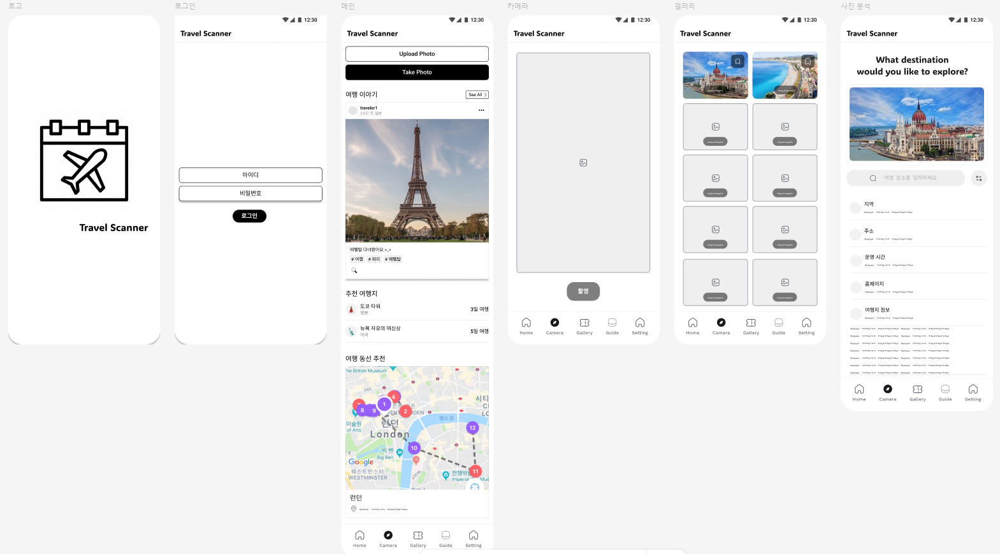

# Travel Scanner (여행 가이드 앱)

## 앱 정보

- **앱 이름** 

  - Travel Scanner    

- **시장(마켓)**  

  - 2023년 기준 글로벌 디지털 여행 시장 규모는 약 8,000억 달러 이상
  - 코로나 이후 해외여행 수요가 2019년 대비 150% 증가
  - AI 기반 개인 맞춤형 여행 추천 서비스가 각광받고 있으며, 모바일 중심 여행 서비스(여행 예약, 가이드 앱, AI 기반 추천) 수요 급증

- **타겟**  

  - 여행을 기록하고 싶은 사용자
  - 여행지 정보를 빠르게 검색하고 싶은 사용자
  - 여행 가이드 및 관광 정보를 개인화하고 싶은 사용자


## 앱 구조도




## 앱 와이어프레임 (사용 툴 : Figma)




## 프로토타이핑 (사용 툴 : Figma)


## 페이지 구현 (flutlab)
1. 로고 - 첫 화면입니다. Travel Scanner 로고가 화면에 표시되 3초 후 로그인 화면으로 이동합니다.
2. 로그인 - 로그인 화면입니다. 아이디와 비밀번호를 입력하면 메인 화면으로 이동합니다. (미입력시 이동 X)
3. 메인 - 홈 화면입니다. 여행 이야기, 추천 여행지, 여행 동선 추천으로 이루어져 있습니다. 상단에는 로고가, 하단에는 앱바가 위치해 있습니다.
4. 카메라 - 카메라 기능입니다. 촬영된 사진은 갤러리로 전달합니다.
5. 갤러리 - 촬영된 사진, 다운로드된 사진이 있는 갤러리입니다. 사진을 클릭하면 사진 분석 페이지로 이동합니다.
6. 가이드 - 여행지 정보를 안내해주는 기능입니다. 여행지 명칭을 검색창에 입력하면 외부 API를 통해 여행지 정보를 제공합니다.


## 구현영상 (flutlab)
![Quest5-4)(./250211-4.gif)


# 회고(참고 링크 및 코드 개선)
```
이번 퀘스트에서는 카메라, 갤러리, 사진 분석 기능을 중심으로 어플을 구현하는 것을 목표로 삼았습니다.
그러나 카메라 촬영 기능을 완벽하게 구현하지 못한 점이 아쉽습니다.

그럼에도 불구하고 실제 어플을 만드는 과정에서 로그인 기능, 외부 API 활용, UI 구성 방법 등을 보다 심도 있게 학습할 수 있었습니다.
또한, 웹 환경과 안드로이드 환경에서 사용할 수 있는 API가 상이하다는 점도 인상 깊었으며, 다양한 플랫폼에서의 개발을 고려해야 한다는 점을 실감할 수 있었습니다.

이러한 경험이 앞으로 제가 필요한 어플을 개발하는 데 큰 도움이 될 것이라 기대합니다.
```
