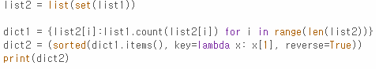
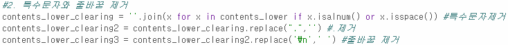
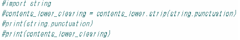

# AIFFEL Campus Online Code Peer Review Templete
- 코더 : 채남병
- 리뷰어 : 강민성


# PRT(Peer Review Template)
- [x]  **1. 주어진 문제를 해결하는 완성된 코드가 제출되었나요?**
    - 완성되지는 않았지만 과정을 보아 시간이 조금 더 주어졌다면 완성하셨을 것 같습니다.
    - 

- [x]  **2. 전체 코드에서 가장 핵심적이거나 가장 복잡하고 이해하기 어려운 부분에 작성된 
주석 또는 doc string을 보고 해당 코드가 잘 이해되었나요?**
    - 코드 작성 과정을 주석으로 보아 각 코드가 어떤 역할을 하는지 알 수 있었습니다.
    - 

- [x]  **3. 에러가 난 부분을 디버깅하여 문제를 해결한 기록을 남겼거나
새로운 시도 또는 추가 실험을 수행해봤나요?**
    - 기호를 제거하는 과정에서 특수문자와 마침표, 줄바꿈표시를 제거하기 위한 과정이 하나하나 나와있었습니다.
    - 
        
- [ ]  **4. 회고를 잘 작성했나요?**
    - 시간이 부족하여 회고는 작성하지 못하셨다고 합니다.
        
- [x]  **5. 코드가 간결하고 효율적인가요?**
    - 가독성과 간결함이 매우 높지는 않지만, 각 코드가 어떤 일을 수행하는지 알 수 있는 코드였다고 생각합니다.

# 회고(참고 링크 및 코드 개선)
```
return함수를 사용하셨다면 더 간결하게 작성할 수 있었을 것 같습니다.
replace함수도 하나하나보다 한번에 특수문자를 다 기입하면 한 줄의 코드로 구현할 수 있었을 것 같습니다.
하지만 ai의 힘을 빌리지 않으시고 작성하셨다는 게 대단하다고 생각합니다.
저도 더 열심히 해야겠습니다.
```
