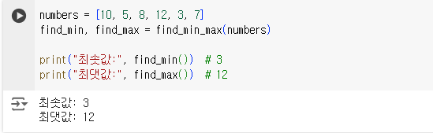
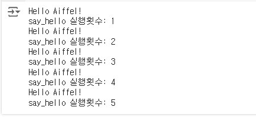
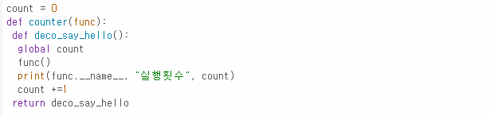
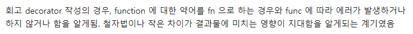
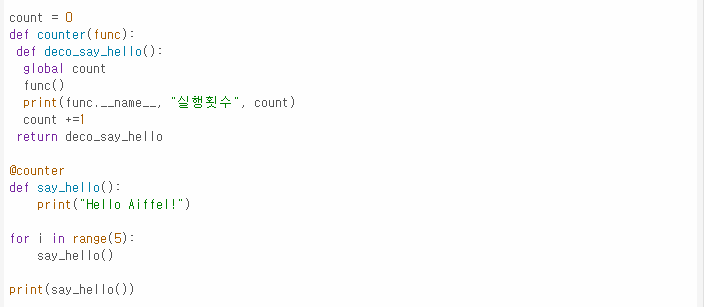

# AIFFEL Campus Online Code Peer Review Templete
- 코더 : 채남병
- 리뷰어 : 이은솔


# PRT(Peer Review Template)
- [x]  **1. 주어진 문제를 해결하는 완성된 코드가 제출되었나요?**
    - 문제에서 요구하는 최종 결과물이 출력됩니다.
    - 
    -  
       
- [ ]  **2. 전체 코드에서 가장 핵심적이거나 가장 복잡하고 이해하기 어려운 부분에 작성된 
주석 또는 doc string을 보고 해당 코드가 잘 이해되었나요?**
    - 주어진 문제에 작성된 주석 외에 코드의 작동 원리 등이 기술되어 있지 않습니다.
    -  
        
- [ ]  **3. 에러가 난 부분을 디버깅하여 문제를 해결한 기록을 남겼거나
새로운 시도 또는 추가 실험을 수행해봤나요?**
    - 문제 원인 및 해결 과정이나 추가적으로 수행한 나만의 실험은 기록되어 있지 않습니다.
        
- [x]  **4. 회고를 잘 작성했나요?**
    - 첫번째 두번째 문제 모두 문제해결 과정에서 느낀 부분을 작성해주셨습니다.
    - 두번째 회고의 내용을 통해 저 또한 몰랐던 사실을 배울 수 있었습니다.
    -  
    -  
        
- [x]  **5. 코드가 간결하고 효율적인가요?**
    - 코드 중복을 최소화하고 범용적으로 사용할 수 있도록 함수화하였습니다.
    - 코드가 간결하여 효율적입니다.
    -  


# 회고(참고 링크 및 코드 개선)
```
# 저희 팀에서 작성한 코드와 거의 같았습니다. Q2 회고에 작성해주신 내용(decorator의 경우, function 에 대한 약어를 fn 으로 하는 경우와 func 에 따라 에러가 발생하거나 하지 않거나 함을 알게됨) 덕분에 새로운 부분을 배웠습니다.

```
