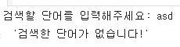
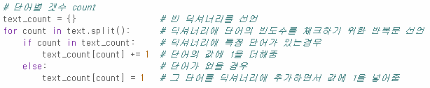
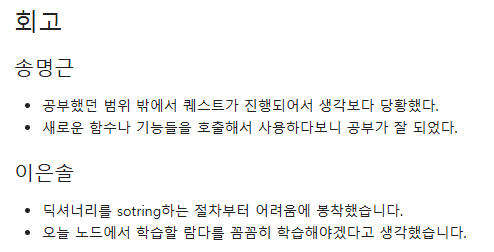

# AIFFEL Campus Online Code Peer Review Templete
- 코더 : 이은솔
- 리뷰어 : 김민상


# PRT(Peer Review Template)
- [X]  **1. 주어진 문제를 해결하는 완성된 코드가 제출되었나요?**
    - 결과물이 잘 작동했다  
    
    
- [X]  **2. 전체 코드에서 가장 핵심적이거나 가장 복잡하고 이해하기 어려운 부분에 작성된 
주석 또는 doc string을 보고 해당 코드가 잘 이해되었나요?**
    - 딕셔너리에 한번에 처리하는 과정이여서 이해하기 어려울수 있지만 주석으로 셜명해놓아서 이해하기 좋았다.  
    
        
- [ ]  **3. 에러가 난 부분을 디버깅하여 문제를 해결한 기록을 남겼거나
새로운 시도 또는 추가 실험을 수행해봤나요?**
    - 문제 원인 및 해결 과정을 잘 기록하였는지 확인
    - 프로젝트 평가 기준에 더해 추가적으로 수행한 나만의 시도, 
    실험이 기록되어 있는지 확인
        - 중요! 잘 작성되었다고 생각되는 부분을 캡쳐해 근거로 첨부
        
- [X]  **4. 회고를 잘 작성했나요?**  
    
        
- [ ]  **5. 코드가 간결하고 효율적인가요?**
    - 파이썬 스타일 가이드 (PEP8) 를 준수하였는지 확인
    - 코드 중복을 최소화하고 범용적으로 사용할 수 있도록 함수화/모듈화했는지 확인
        - 중요! 잘 작성되었다고 생각되는 부분을 캡쳐해 근거로 첨부


# 회고(참고 링크 및 코드 개선)
```
-김민상:  전체적으로 코드가 간결하다 그리고 결과물도 예쁘게 출력이 되었다. 회고도 마크다운을 사용하여 깔끔하게 작성하였다. 다음 미션은 나도 이렇게 해야겠다는 생각이들었다. 하지만 코드들이 전부 함수안에있어 변경이 어려워보이고 범용적이지 않아보였다. 코드들을 주석으로 나눈것처럼 실제 작동하는부준도 분리해서 수정이나 추가가 쉽게하였으면 더 좋았을것같다.
```
