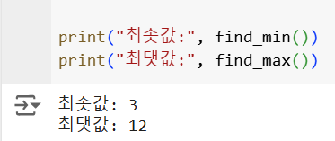
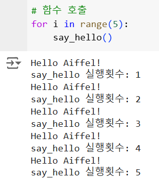
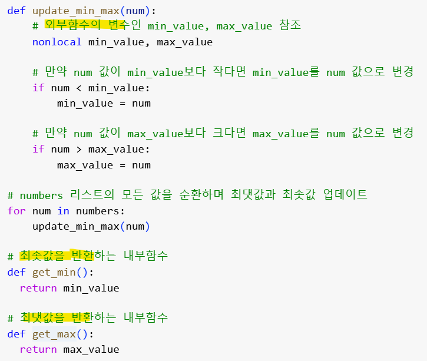
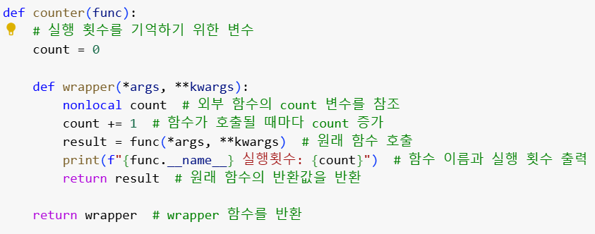

# AIFFEL Campus Online Code Peer Review Templete
- 코더 : 이은솔
- 리뷰어 : 채남병


# PRT(Peer Review Template)
- [Y]  **1. 주어진 문제를 해결하는 완성된 코드가 제출되었나요?**
    - 네. 전체 코딩이 작성되었고, 요구한 결과가 출력됨
    -  
    - 
    
- [Y]  **2. 전체 코드에서 가장 핵심적이거나 가장 복잡하고 이해하기 어려운 부분에 작성된 
주석 또는 doc string을 보고 해당 코드가 잘 이해되었나요?**
    - 
    -  지역변수를 불러오는 것과 클로저에서 발생한 결과물을 불러오는 함수가 제대로 만들어짐
    - 
    - 데코레이터가 주어진 과제 수행에 필요한 내용들을 포함함 
 
        
- [X]  **3. 에러가 난 부분을 디버깅하여 문제를 해결한 기록을 남겼거나
새로운 시도 또는 추가 실험을 수행해봤나요?**
    - 주어진 결과물에 근거하여서는 디버깅 여부를 확인할 수 없음
    - 새로운 시도 또는 추가 실험에 대해 내용 확인할 수 없음
        
- [Y]  **4. 회고를 잘 작성했나요?**
    - 문제 해결 과정에 중에 느낀 바에 대한 내용이 간략히 정리되어 있음
    - ![회고.] (./ensol_3.png)
        
- [Y/N ]  **5. 코드가 간결하고 효율적인가요?**
    - 
    - 가역변수가 쓰여져야 하는 이유에 대한 설명이 있었다면 좋았겠음
    - Result 를 굳이 입력하지 않아도 결과물에는 영향을 미치지 않음. 따라서 간결성 측면에서 확인 바람


# 회고(참고 링크 및 코드 개선)
```
# 이은솔님과 권중님이 협업한 내용을 확인할 수 있었습니다.
# 위의 코드의 간결성 부분에 내용 작성한대로 좀더 쉽고 간단한 코드 작성도 고려해 주셨으면 합니다.

